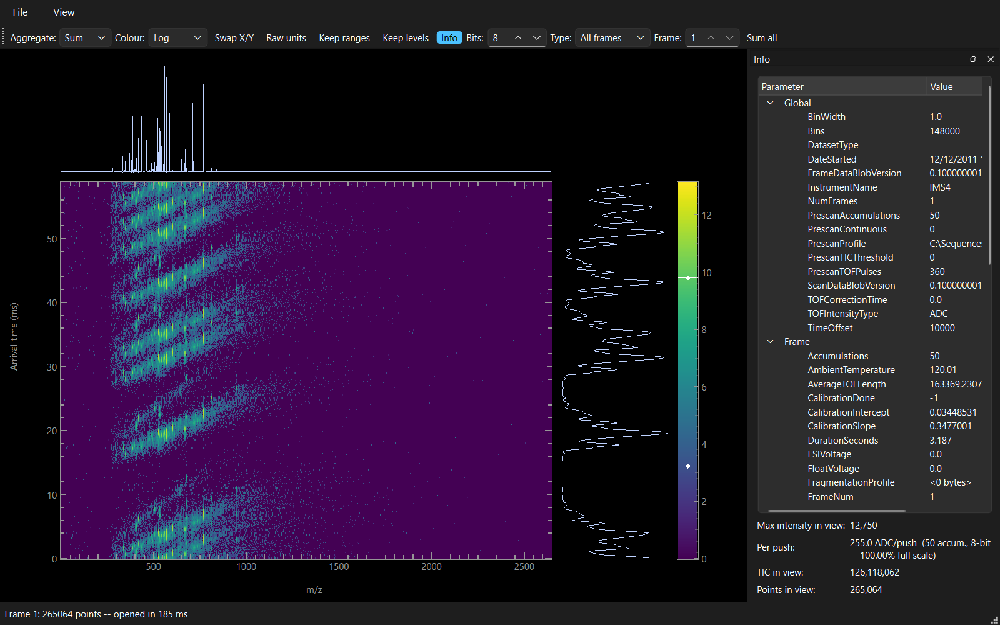
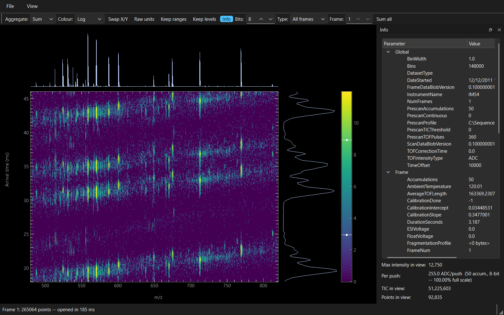

# mainspring user guide

mainspring shows one frame of a UIMF file as a heat map of m/z against arrival time, with the
mass spectrum of the visible region above it and the arrival-time distribution of the same
region beside it. This guide covers what the window shows, what each control does, and how to
read the two intensity numbers the info panel reports. Every control also carries a
one-sentence tooltip on hover, which says what it does; this document says why you would reach
for it.

## Starting the viewer

To run the viewer from a source checkout, follow the fresh-clone steps in the top-level
[`README.md`](../README.md) and then:

```
uv run mainspring
uv run mainspring FILE.uimf
```

The same `README.md` links the installer, which needs no Python installation, and covers
building the executable and compiling the installer yourself. That installer is per-user and
needs no administrator rights, because the viewer writes nothing outside your own profile.
Windows 11 is the platform the viewer is tested on. The installer also offers to open `.uimf`
files with mainspring; accept it and a double-click in
Explorer opens the viewer directly, unless something else was already set to open `.uimf` on
that machine, in which case mainspring is offered as a choice rather than replacing it
(Settings > Default apps).

## Opening a file

Use `Ctrl+O`, or `File > Open`, or pass a path on the command line, or double-click a `.uimf`
file in Explorer, or drop one onto the executable. The viewer remembers the directory you last
opened from and starts the dialog there.

Decoding runs on a background thread, so the window stays responsive while it works, and an
indeterminate progress bar sits in the status bar until the first image appears. The status bar
then reports the frame number, how many stored points it holds, and how long the open took. The
window title becomes the file's name.

A file opened from Explorer or a drag onto the executable that fails to decode gets a dialog
naming the file and the reason, since the window has nothing on screen yet to explain itself;
a file chosen from `File > Open` that fails reports the same reason in the status bar, since
you are already looking at the window.

File size and frame count are not what the open costs. A raw per-repetition acquisition of
5,000 frames over 83 MB opens and paints its first frame in under 0.2 seconds, because the
viewer reads one frame and rasterises it to the size of the window rather than loading the
file. Paging to another frame costs about 5 milliseconds however far into the file it is.

A file the instrument is still writing opens the same way, and the `Follow` control then keeps
it up to date as the run continues. See [Following a file being
acquired](#following-a-file-being-acquired).

## The window



Five things fill the window above the status bar.

**The heat map** fills most of it. The horizontal axis is m/z, the vertical axis is arrival time
in milliseconds, and the colour of each pixel is the intensity of the points that fall inside
it. Ticks point inward on all four sides, with values on the bottom and left.

**The mass spectrum** sits above the heat map and **the arrival-time distribution** to its
right. Both are projections of what is on screen rather than of the whole frame: the spectrum
sums the points inside the current arrival-time range, and the distribution sums those inside
the current m/z range. Narrowing one axis therefore sharpens the other plot. Neither carries an
axis of its own, because the heat map's axes already read for the axis they share and their
intensity axis rescales with every gesture.

**The colour bar** is the strip in the far right column of the plot area. It reads in the units
`View > Colour scale` selects, so on the `Linear` setting its numbers are stored intensities and
on `Log` or `Square root` they are the transformed values. Drag either handle to set the limits by
hand. Its gradient is one of four perceptually uniform colour maps (`Viridis`, `Plasma`,
`Inferno`, `Magma`), chosen from `View > Colour map`.

**The info panel** is docked on the right. `Ctrl+I` hides and shows it, and it can be dragged
out of the window and floated.

The screenshot above is PNNL's `9pep_mix` test file, which
[`tools/fetch_testdata.py`](../tools/fetch_testdata.py) downloads, with the colour scale set to
`Log`. The diagonal bands are the multiplexed encoding that file was acquired with.

## Light mode

`View > Light mode` draws the plot area on white instead of black. It takes effect as you
tick it, and it costs nothing: the open file, the frame you are on, the ranges you have zoomed
to and any levels you have pinned are all where you left them. The viewer remembers the choice,
so the next session starts in the mode you last used. Black is the default.

The colour map is not part of the mode. `Viridis` and its three companions read as themselves
whichever background they sit on, and a map that changed under you would make two figures of the
same frame hard to compare, so `View > Colour map` stays yours to set. A frame with little in it
therefore draws as a dark rectangle on a white canvas, because dark purple is what the low end of
`Viridis` is.

The menu bar, the toolbar, the info panel and the dialogs follow Windows rather than this
setting. They are already light on a stock Windows install, which is what makes a light plot
area match the rest of the window.

## Moving around the frame

Every gesture is one step. There is no mode to switch into first and no zoom history to unwind,
because a wrong zoom costs one keystroke to undo.

| Gesture | What it does |
|---|---|
| Scroll wheel | Zoom about the pointer, both axes together |
| `Ctrl` + wheel | Zoom the horizontal axis alone |
| `Shift` + wheel | Zoom the vertical axis alone |
| Left-drag | Pan |
| Right-drag | Zoom to the box, applied when you release |
| `Shift` + left-drag | The same box, for trackpads and remote desktop |
| Double-click | Reset to the frame's full range |

The same two gestures work on either projection, where they act on the one axis that
projection shares with the heat map.

| Gesture on a projection | What it does |
|---|---|
| Right-drag | Zoom the shared axis to the band, applied when you release |
| `Shift` + left-drag | The same band, for trackpads and remote desktop |
| Double-click | Reset that axis alone, leaving the other where it is |

A projection is often where the peak you want is visible: the mass spectrum resolves an
isotope pattern that the heat map draws as a single column, so picking the pattern off the
curve is easier than boxing it on the image. Dragging along the curve sets the m/z range and
leaves the arrival-time range alone; dragging down the arrival-time distribution does the
reverse. Panning and the wheel do nothing on a projection, because a curve moved away from the
image it belongs to would no longer describe it.

| Shortcut | What it does |
|---|---|
| `Ctrl+O` | Open a file |
| `Home` | Reset the view to the frame's full range |
| `Ctrl+I` | Show or hide the info panel |

All three are on the menu bar as well: `Open` under `File`, and `Reset view`, `Info`,
`Light mode`, `Colour map` and `Colour scale` under `View`. `Aggregate`, `Type` and `Bits` are
under `Data settings`. There is no context menu on the heat map, because the right button is a
zoom gesture.

Zooming and panning are both clamped to the frame, so a gesture cannot leave it, and zooming in
stops when the visible range is two source elements across. On a SLIMPHONY frame that floor is
0.125 in m/z, which is about four TOF bins at m/z 530 and well inside an isotope pattern.

Each gesture is answered by a fresh render at the viewport's pixel size rather than by
magnifying the previous image. Requests are coalesced over 30 ms and only the newest is drawn,
so a burst of wheel ticks costs one image rather than one image per tick. The previous image
stays on screen and stretches while the next is being computed, which is what makes a fast drag
continuous.

The zoomed view below is the same frame and the same window, narrowed to m/z 480 to 820 and
arrival time 18 to 46 ms. Both projections have been recomputed over that region: the mass
spectrum now resolves individual peaks that the full-range view drew as one column, and `TIC in
view` has fallen from 126,118,062 to 51,225,603.



## The View menu

### Colour map

The gradient the heat map and the colour bar are drawn with, one of `Viridis`, `Plasma`,
`Inferno` and `Magma`. All four are perceptually uniform, so a step in colour is a step in
intensity and never an artefact of the map. The viewer offers no rainbow map for that reason.

### Colour scale

How intensity maps onto colour. `Linear` is proportional. `Log` and `Square root` compress the
dynamic range, which is what to reach for when one peak is bright enough to leave the rest of
the frame flat. All three are display transforms only. The cursor readout and the info panel
always quote the untransformed intensity, so switching the colour scale changes the picture and
no number.

## The Data settings menu

Three controls that say what the numbers on screen are, rather than how they are drawn.
None of them is touched in the ordinary course of looking at a frame: the aggregate and the
bit depth are set once for a session and the type filter once for a file.

### Aggregate

A full-range view of a SLIMPHONY frame puts about 700 source elements inside each screen pixel,
114,688 TOF bins by 5,000 scans drawn 1,200 pixels by 700, and this chooses what the pixel then
shows. `Sum` adds them, which conserves total intensity and is the default. `Max` takes the
largest, which keeps a one-bin spike visible in a view where summing would bury it under a
broad neighbour.

The cursor readout in the status bar names the aggregate beside every intensity it quotes, for
the same reason: a summed pixel is a total over however many bins and scans it covers, and it
is not a stored intensity.

### Bits

The digitizer's bit depth, from 1 to 32, which the per-push readout uses to work out what
fraction of full scale a count is. PNNL's parameter set has no name for bit depth, so on a file
their acquisition software wrote this is a setting rather than something the viewer can read.
SLIMPHONY's current digitizer is 8-bit and clockwork will use 14-bit. Set it before you read
anything off the per-push line.

A file clockwork wrote stores the bit depth of the digitizer that produced it. On such a file
the control shows the stored value and cannot be changed, because the number in use is the
file's. The per-push readout says which of the two it is using.

### Type

Restricts the frame spinner and `Sum all` to frames of one type: `MS1`, `MS2`, `Calibration`,
`Prescan`, or `All frames`. A file whose writer used a code this list has no name for shows it
as `Type N` rather than hiding those frames.

## The toolbar

### Swap X/Y

Puts arrival time on the horizontal axis and m/z on the vertical. The two projections follow,
because each is named for the axis it projects onto rather than for a quantity: the plot above
the image is always the projection onto the horizontal axis and the plot to its right always
the projection onto the vertical one.

The visible region is carried across the swap rather than reset, so the same bins and scans
stay on screen.

### Raw units

Shows the TOF bin index and the scan number in place of calibrated m/z and arrival time. Use it
when the question is about the instrument rather than about the sample, since a bin identifies
the digitizer sample a count came from and an m/z does not.

The visible region is carried across this toggle too. A frame the writer never calibrated is
shown in raw units whatever this setting says, because a plausible-looking m/z axis over
uncalibrated data is worse than an honest bin axis.

### Keep ranges

Keeps the current m/z and arrival-time ranges when the next file is opened, instead of resetting
to the new frame's full extent. Set the window once and page through twenty acquisitions in it.
The setting survives restarts.

Moving between frames of one file always keeps the view, whether or not this is ticked. Keep
ranges is about what happens across a file open.

### Keep levels

Keeps the colour bar's current limits instead of rescaling them to each new image. Tick it and
the limits on screen at that moment are pinned, across new frames and new zooms alike, until
you untick it. Two frames drawn under one set of limits can be compared by eye; two frames each
scaled to its own maximum cannot.

### Info

Shows and hides the info panel, on `Ctrl+I`. The panel's own close button is the same switch.

### Frame

Goes to a frame by number, within the frames the type filter allows. Typing or stepping to a
number outside that set snaps to the nearest frame inside it. The view is preserved.

### Method frame, Rep, and Sum method frame

These three appear only on a file that records which method frame each of its frames belongs to.
clockwork writes that record; PNNL's acquisition software has nowhere to put it, so on their
files the controls are absent and everything else behaves as described above.

A clockwork raw acquisition stores one frame per repetition. A method frame asking for 100
accumulations is therefore 100 consecutive frames in the file, and a session is many method
frames. `Method frame` and `Rep` are the two axes of that arrangement. Stepping `Method frame`
holds the repetition and shows the same point of each successive experiment; stepping `Rep`
holds the method frame and shows one experiment repetition by repetition, which is how you see
whether the repetitions drift. The `Frame` spinner still reaches any frame by its file number,
and all three stay in step.

Beside `Rep` the toolbar reports how many repetitions the method asked for. When a method frame
holds fewer frames than that, the readout gives both numbers, as in `of 87, method asked 100`.
A method frame reads short when a run was cancelled, when a power failure ended it, and while
it is still being acquired.

`Sum method frame` adds every repetition of the method frame on screen into one heat map. That
sum is the summed arrival-time distribution of one ion mobility experiment, which is what a
per-repetition file has to be added back up into to be read the way a summed file is. A method
frame of 100 frames takes about half a second.

### Sum all

Adds every frame the type filter allows into one heat map, drawn in place of the current frame.
A progress dialog counts the frames as they are read and cancels cleanly, leaving the frame
already on screen. Cancelling discards the partial total rather than showing it, because a sum
over an unknown number of frames is not a quantity anyone can use.

The status bar names the result as a sum and how many frames went into it, so a summed image is
never mistaken for a single frame. On a raw per-repetition file of 5,000 frames the whole sum
takes about 20 seconds, so use `Sum method frame` when one experiment is what you want.

### Follow

Watches the open file for what the instrument writes to it, once a second, and keeps the frame
spinner, the type filter and the repetition count in step with what is there. `Show`, beside it,
decides what following does with each new frame. Both are covered in [Following a file being
acquired](#following-a-file-being-acquired).

### Show

`Fixed frame`, `Newest frame`, or `Method frame sum`. Available while `Follow` is on, and
described with it below.

## Following a file being acquired

To watch a run as it happens, open the file the acquisition is writing and turn on `Follow`. The
viewer then asks the file once a second what has been added to it. Nothing about the acquisition
changes: every read is a separate read-only connection that is opened, used and closed, which is
what keeps the viewer out of the writers' way.

Each poll costs about 10 milliseconds of query on a file of 5,000 frames, and a frame becomes
visible within 3 milliseconds of the software that wrote it saying it is finished. The second
between polls is the whole of the delay you see.

`Show` decides what happens to the view:

- **`Fixed frame`** leaves the view exactly where you put it. The frame spinner's range grows,
  the repetition count beside `Rep` grows, and the frame on screen stays the frame you chose.
  This is the default, and it is what you want while studying one frame of a run that is still
  going.
- **`Newest frame`** moves to each frame as it arrives, including the frame being written at
  this moment. A frame is about one second of acquisition and its scans reach the file in
  batches, so the frame fills in front of you rather than appearing whole.
- **`Method frame sum`** keeps a running total of the finished repetitions of the method frame
  being acquired, which is the summed heat map a finished file holds. It appears only on a file
  that records how its frames group, which today means a file clockwork wrote. The total is
  recomputed when a repetition finishes and not while one is being written, so it only ever
  grows.

The zoom, the colour levels and every other setting are untouched by any of this. Following
changes which frame is on screen, never how it is drawn.

### Frames that are not finished yet

A frame the instrument may still be adding scans to is drawn like any other and labelled
`still being written`, in the status bar under the plot and beside `Frame:` in the info panel.
The viewer never keeps such a frame in its cache, so every poll reads what is actually in the
file rather than what was there a second ago.

A file clockwork wrote says frame by frame when a frame is finished, so the label is exact. No
other writer records it, and on their files the viewer falls back to treating the last frame of
a recently written file as unfinished. That fallback errs towards saying `still being written`
about a frame that is in fact complete, which costs a re-read and nothing else.

A frame whose completion was lost to a power failure reads as unfinished for good. That is
honest rather than a defect, because such a frame may well be short. Its data are intact and
every frame before it reads as complete.

### What cannot be followed

`Follow` is refused on a file that is not on a drive attached to this machine, and the status bar
says so. Following means reading a database while another process writes it, and the two
processes coordinate through shared memory that only exists when both are on the same machine.
Opening and reading a file over a share is unaffected. It is only following one that is refused.

Following is also switched off whenever another file is opened, and it is not remembered between
sessions. It describes one acquisition rather than a way of working.

## The status bar

The left of the status bar carries the open and frame messages. The right carries the cursor
readout, which reports, for the pointer's position:

- both display values with their axis labels, m/z and arrival time by default;
- the raw TOF bin and scan number, always, whichever units the axes are in;
- the intensity drawn at that pixel, labelled with the aggregate that produced it.

Both unit systems appear because they answer different questions and neither can be recovered
from the other by eye. The intensity is read back out of the image on screen rather than
recomputed, so it describes what you are looking at.

## The info panel

The upper half of the panel is the file's own parameters, global first and then the open
frame's, exactly as the file stores them. It is not a fixed list. Whatever keys the file's
parameter tables carry are what the tree shows, so a writer's optics voltages and its own
private keys appear alongside the handful the viewer itself parses.

Drag the panel's left edge to make it wider, and the value column widens with it. The viewer
remembers the width. A value still too long for the column is shown whole on hover, so a
calibration coefficient cut off at an ellipsis is one pointer away from being readable.

The lower half is one statement about the frame and four readouts, all of them describing the
image on screen rather than the whole frame, and all of them recomputed on every view change.

### Frame

`complete`, or `still being written` for a frame the instrument may be adding scans to. A
summed heat map shows `-`, because the question belongs to the frames that went into it and the
status bar names those. See [Frames that are not finished
yet](#frames-that-are-not-finished-yet).

### Max intensity in view

The largest single stored intensity inside the visible region. This is a stored value even when
`Aggregate` is set to `Sum`, so it is a detector reading rather than a pixel total, and it is
the number the per-push line divides by `Accumulations`.

### Per push

A UIMF intensity is the ADC sum over the frame's `Accumulations` time-of-flight pulses, and one
pulse is one push. The largest single-push value in view is therefore the maximum above divided
by `Accumulations`, reported here in ADC counts and as a percentage of full scale at the bit
depth the `Bits` control is set to. This is the number that says whether the detector is
saturating.

The readout states the `Accumulations`, the bit depth, and where the bit depth came from, so
that a count is never quoted without the two numbers that produced it. A file clockwork wrote
carries the digitizer's own bit depth and the readout says `from file`. Every other file leaves
the depth to the `Bits` control and the readout says `from setting`. Note that in the second
case the percentage is only as right as the setting. Quote a per-push value with the
`Accumulations` and the bit depth, or do not quote it.

### TIC in view

The total stored intensity inside the visible region, summed over every point in it. At full
range this equals the sum of the file's own `TIC` column for the frame.

### Points in view

How many stored, non-zero points fall inside the visible region. A UIMF frame is stored as the
points that exist rather than as a dense array, and this is a count of those, not of screen
pixels.

## Exporting a figure

`File > Export PNG` and `File > Export PDF` write what is on screen to a file. The heat map,
the mass spectrum and the arrival-time distribution all go in, at the zoom and under the
colour settings they are drawn with. The colour bar is left out. The figure takes the
background of the mode it was exported in, so tick `Light mode` first for a figure going into
a paper or onto a white slide.

Both entries ask where to write the file, then at what resolution. The four choices are 96,
150, 300 and 600 dpi. At 96 dpi the figure is the window's own pixels, one for one, and at 300
dpi each axis carries 3.125 times as many; the dialog names the pixel size and the size in
inches before you commit to it. A figure over 50 megapixels is refused, which a maximised
window on a 4K display reaches at 600 dpi.

The heat map is redrawn for the export rather than scaled up. The image on screen holds about
one sample per screen pixel, so enlarging it would give a sharp frame around a blurred map.
The frame is rasterised again at the export's own resolution instead, and a 300 dpi figure
therefore separates peaks that ran together on screen. Note that this stops where the data do:
zoomed in far enough that each bin and scan already covers more than one pixel, every
resolution returns the same image.

Colour limits are carried across as the fraction of the range they sit at rather than as
numbers. A pixel of a finer image covers less of the frame and holds less intensity, so the
limits that suit the screen would leave a 300 dpi figure nearly black. Limits left to scale
themselves come out scaled to the exported image, and limits pinned with `Keep levels` keep
the contrast that pinning chose.

A PDF carries the axes, the ticks, the labels and both projections as vector drawings, so
they stay sharp at any magnification, and it embeds the heat map at the resolution you asked
for. Its page is the same size in inches whichever resolution that is.

## What the viewer remembers

Every toolbar toggle, the colour map and the colour scale, light mode, the aggregate, the
detector bit depth, whether the info panel is showing and how wide it is, the export
resolution, the window's size and position, and the directory you last opened from are all
saved when the viewer closes and restored when it starts. On Windows they live under
`HKEY_CURRENT_USER\Software\University of Washington\mainspring`. Deleting that key returns
every setting to its default.

The pinned colour levels and the current view range are not among them. Keep levels and keep
ranges persist as switches, and what they hold is whatever is on screen in the session where
you turn them on.

`Follow` is not remembered either, and it is the one toolbar control that is not. It says
something about one file rather than about how you like to look at data, and a viewer that
started polling every finished acquisition anyone opened would be doing work against nothing.

The saved bit depth is the `Bits` setting, and opening a file that stores its own does not
overwrite it. Close such a file and the control returns to the number you set.
